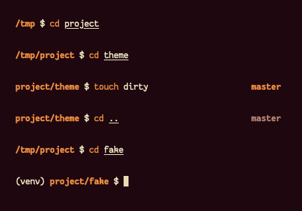

# ZSH : Bash Extended Prompt

Despite the name, a zsh prompt made to be simple.  
Does NOT require `oh-my-zsh`.
Roughly based off of [Agnoster's theme](https://github.com/agnoster/agnoster-zsh-theme), but without powerline symbols.

## Usage
Left prompt:
- virtualenv
- working directory, truncated to 2 dirnames

Right prompt:
- git status
  - branch (name) or detahced head (short sha1)
  - dirty working directory (symbol and color change)
- `hostname` if `$SSH_CONNECTION` is set
- error code if previous command failed

## Installation
With a zsh plugin manager, add `amar1729/bash-extended` to your plugins.

## TODO
- add note on removing `omz` dependency
- implement https://github.com/romkatv/gitstatus for faster git status
  - benchmarking
